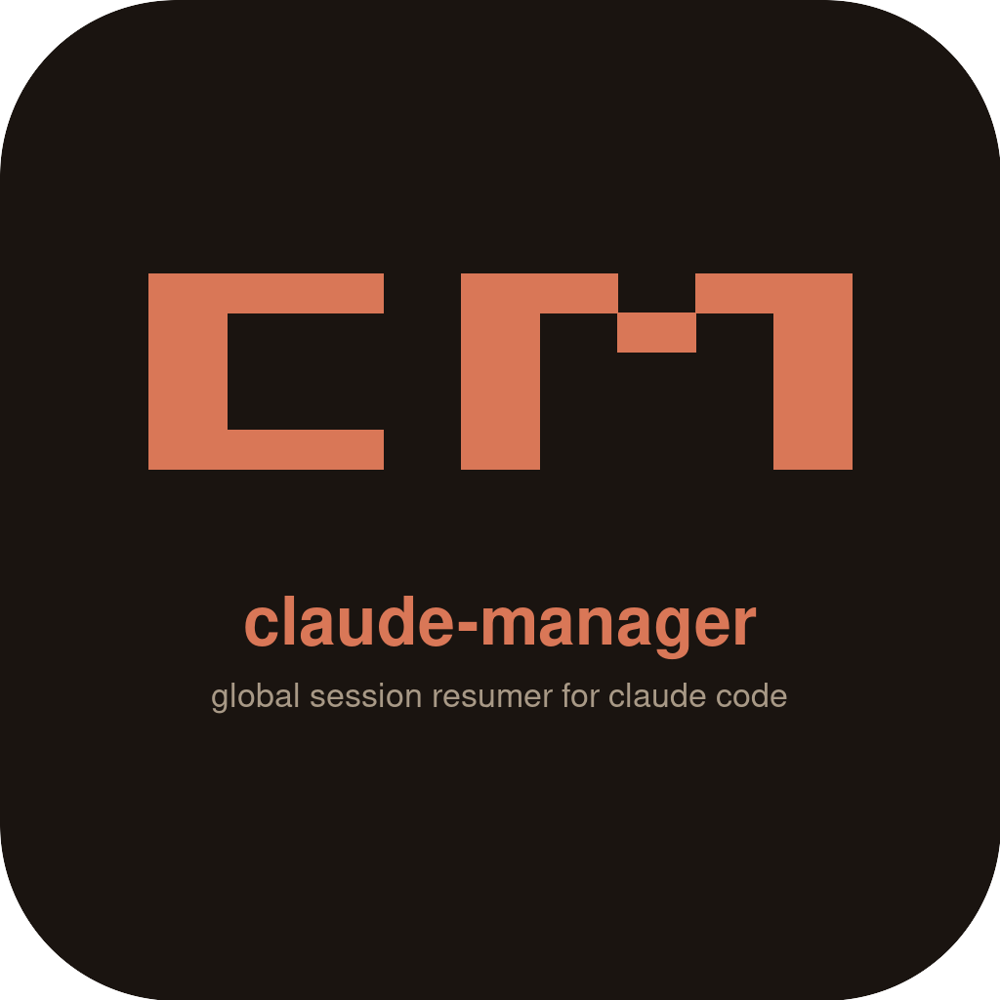

<p align="center">
  
</p>

<pre align="center">
   █▀▀ █▀▄▀█    claude-manager
   █   █   █    global session resumer for claude code
   ▀▀▀ ▀   ▀
</pre>

<p align="center"><strong>A global session manager + resumer for <a href="https://claude.com/claude-code">Claude Code</a>.</strong></p>

<p align="center">
  Run <code>cm</code> from any directory · fuzzy-search every Claude chat you've ever had · hit enter →<br/>
  your shell <code>cd</code>'s into the original project and resumes with the exact original <code>claude</code> flags.
</p>

<p align="center">
  
</p>

<p align="center">
  <a href="assets/videos/longvideo.mp4">▶ HD MP4 (78s, full feature tour)</a>
  &nbsp;·&nbsp;
  <a href="assets/videos/shortvideo.mp4">▶ short MP4 (14s, hero clip)</a>
</p>

```
╭─ ◆  claude-manager   session resumer                    121 of 121 sessions  v0.2.0 ─╮

 1 sessions    2 overview    3 projects    4 help

  >  #bug auth▮                                                                7 / 121

╭──────────────────────────────────────────────────────────────────────────────────╮
│  ── ★ favorites ────────────────────────────────────────────────────────────     │
│ ▌▌  *  ts   auth-rewrite                   ~/projects/api          2h ago  #bug  │
│  ── today ───────────────────────────────────────────────────────────────────    │
│ [x]    py   debug failing migration        ~/work/db              17m ago  #bug  │
│        rs   crab shell skeleton            ~/code/crab             3h ago        │
│  ── yesterday ───────────────────────────────────────────────────────────────    │
│        ts   refactor websocket reconnect   ~/projects/api          1d ago  #bug  │
╰──────────────────────────────────────────────────────────────────────────────────╯
╭──────────────────────────────────────────────────────────────────────────────────╮
│  ~/projects/api    42 msgs    18.4k tok                                          │
│                                                                                  │
│  ▎ you   refactor the auth middleware to use the new session token format        │
│  ▎ asst  i'll start by reading the current middleware to understand…             │
╰──────────────────────────────────────────────────────────────────────────────────╯

  ↵ resume   r rename   t tag   f favorite   d delete   Tab view   ? help   q quit
```

---

## Install

Requires [Bun](https://bun.sh) (≥ 1.1):

```bash
curl -fsSL https://bun.sh/install | bash
```

Then from inside this repo:

```bash
bun install
ln -sf "$(pwd)/src/cli.ts" ~/.bun/bin/claude-manager
bun src/postinstall.ts                                # install hook + patch ~/.claude/settings.json + initial scan
echo 'eval "$(claude-manager init zsh)"' >> ~/.zshrc  # or .bashrc / .config/fish/config.fish
exec $SHELL
```

The `eval "$(claude-manager init <shell>)"` line installs both the `cm()` shell function (which `eval`s the resume line so your parent shell actually `cd`s) **and** tab-completion for `cm <name>`.

Verify with:

```bash
claude-manager doctor       # 5/5 checks should pass
```

---

## Commands

| Command | Description |
| --- | --- |
| `cm` | open the TUI |
| `cm here` | TUI pre-filtered to `$(pwd)` |
| `cm last` | resume the most recent session, no TUI |
| `cm <name>` | exact `custom_name` match → resume immediately (Tab-complete works) |
| `cm <fuzzy>` | closest match → confirm prompt (`↵` resume, `t` open TUI, anything else cancels) |
| `claude-manager scan` | re-run backfill from `~/.claude/projects/` |
| `claude-manager doctor` | health check (registry, hook, settings patch, claude on PATH) |
| `claude-manager prune` | delete sessions older than `prune_days` setting |
| `claude-manager uninstall` | remove hook + settings patch (registry preserved) |
| `claude-manager export <id\|name>` | dump a session transcript to stdout (raw JSONL) |
| `claude-manager export <id\|name> --md` | dump as clean markdown (role headers, code fences, tool calls) |
| `claude-manager grep <pattern>` | search message content across all transcripts; coral-highlights the match in TTY |
| `claude-manager auto-name <id>` | call `claude -p` to summarize the chat into a 3-word kebab-case name |
| `claude-manager auto-name --all` | name every unnamed session (max 10 per invocation) |
| `claude-manager theme list` | list themes with the active one marked |
| `claude-manager theme <name>` | set the active TUI theme (persists) |
| `claude-manager theme reset` | back to coral default |
| `claude-manager completions` | print completion tokens (used by the shell wrapper) |
| `claude-manager init [bash\|zsh\|fish]` | print shell wrapper + completion for `eval` |

---

## Themes

Five built-in palettes, switchable live and persisted:

| Name | Vibe |
| --- | --- |
| `coral` (default) | Claude brand — coral on warm off-white |
| `catppuccin` | Catppuccin Mocha — pink/lavender |
| `gruvbox` | Gruvbox dark — burnt orange |
| `nord` | Nord — frost cyan on slate |
| `mono` | Pure monochrome — works on any terminal |

```bash
claude-manager theme nord
cm                       # rendered in nord palette
```

---

## TUI keys

**Navigation**

| Key | Action |
| --- | --- |
| `↑ ↓` / `j k` | move |
| `Ctrl-u` / `Ctrl-d` | page up / page down |
| `g` / `G` | top / bottom |
| `Tab` / `Shift-Tab` | next / previous view |
| `1` `2` `3` / `?` | jump to sessions / overview / projects / help |

**Actions** (sessions view)

| Key | Action |
| --- | --- |
| `↵` Enter | resume selected session |
| `r` | rename — set `custom_name` (used by `cm <name>`) |
| `t` | add or remove a tag on the current row (toggle) |
| `f` | toggle favorite |
| `d` | delete from registry |
| `H` | show / hide sessions whose project dir is gone |

**Bulk select**

| Key | Action |
| --- | --- |
| `Space` | toggle current row in/out of selection |
| `a` | select all visible rows |
| `d` (with selection) | bulk-delete selected sessions |
| `t` (with selection) | bulk-tag all selected |
| `Esc` | clear selection (or quit if empty) |

**Search**

| Key | Action |
| --- | --- |
| any letter | live fuzzy filter |
| `#tag` | filter to sessions with that tag (AND for multiple, e.g. `#bug #wip`) |
| Backspace | remove last char |
| `q` / `Ctrl-c` | quit (no resume) |

---

## Views

The TUI has four tabs (`Tab` to cycle, or `1`/`2`/`3`/`?` to jump):

1. **sessions** — the picker. Time-bucketed groups (`★ favorites` / `today` / `yesterday` / `this week` / `this month` / `older`). Per-project language tag (`ts` `js` `py` `rs` `go` `rb` `dn` `jv` `git`). Tag chips on rows that have any.
2. **overview** — totals (sessions / favorites / messages / tokens / **estimated cost**), 30-day session sparkline, **this-week** (sessions / tokens / cost), **by-model** breakdown sorted by cost, oldest→newest span.
3. **projects** — cwd grouping with horizontal coral bars sized by session count, last-activity timestamps.
4. **help** — full keymap reference grouped by category.

---

## Custom names + tab completion

Press `r` on a row in the TUI to give a session a memorable name:

```
rename  refactor the auth middleware  →  auth-rewrite▮
```

Then from any directory:

```bash
$ cm aut<Tab>     # → cm auth-rewrite
$ cm auth-rewrite # resumes immediately — no prompt
```

Close-but-not-exact matches get a confirmation:

```bash
$ cm auth

  did you mean  auth-rewrite
  query  auth
  cwd    /home/you/projects/api

  ↵ resume    t open TUI    n/Esc cancel
```

Ranking is `custom_name` (×4) > `first_prompt` (×2) > `cwd` (×1). Exact case-insensitive name match wins immediately.

---

## Tags

Press `t` on a row to add or remove a tag (toggle behavior). Filter with `#tag` in search:

```
  >  #bug auth         only sessions tagged #bug whose title/cwd matches "auth"
  >  #bug #wip         AND — sessions tagged BOTH bug and wip
```

Tags are stored in the `tags` table and surface as small chips on each row when the terminal is wide enough.

---

## Bulk operations

In the sessions view, press `Space` to toggle a row in/out of a selection set. The row gets a `[x]` mark. With selection non-empty:

- `a` — add all visible rows to the selection
- `d` — bulk delete every selected session
- `t` — open the tag input; the typed tag is applied to all selected
- `Esc` — clear selection

---

## Cost tracking

The Overview view estimates spend by combining `token_count` with the model name extracted from `env_json` (`ANTHROPIC_MODEL`) or `launch_argv_json` (`--model <name>`). Pricing rates are baked in for current Opus / Sonnet / Haiku tiers; sessions whose model can't be inferred fall back to a sensible default. The **by-model** panel shows per-model session count and aggregate cost sorted descending.

---

## Auto-name

Press the corresponding flow on the CLI:

```bash
claude-manager auto-name <session-id>      # one session
claude-manager auto-name --all             # name up to 10 unnamed sessions
```

Internally this shells out to `claude -p "in 3-5 words..."` so it inherits your existing Claude auth — no API key handling, no SDK install.

---

## Markdown export

```bash
claude-manager export <id|name> --md > chat.md
```

Output:

```markdown
# auth-rewrite

`/home/you/projects/api` · 2026-04-25 · 42 messages · 18420 tokens

---

### user

refactor the auth middleware to use the new session token format

---

### assistant

i'll start by reading the current middleware…

---
```

Tool calls become fenced blocks with the tool name as the language hint; tool results land in `tool-result` fences.

---

## Transcript grep

```bash
$ claude-manager grep "websocket leak"

abc-123  (~/projects/api · 3h ago)
   user  : here's the failing test, why does it leak?
   asst  : looking at the websocket reconnect logic now…

xyz-789  (~/sandbox · 2d ago)
   asst  : i think the leak is in the cleanup callback
```

ANSI coral highlighting kicks in only when stdout is a TTY (so piping to `grep -v` works cleanly).

---

## How it works

A small Bash hook fires on every Claude `SessionStart` and `Stop`. It writes a single JSON line per event to `~/.claudemanager/queue.jsonl` capturing:

- `cwd`
- The full parent `claude` argv (Linux: `/proc/$PPID/cmdline`; macOS: `ps -o args=`)
- Git branch / SHA (if cwd is a repo)
- An env allow-list (`ANTHROPIC_MODEL`, `ANTHROPIC_BASE_URL`, etc.)
- On stop: message count, token count, first user prompt

The hook is silent — it never writes to stdout/stderr. The Claude UI never sees it.

The next time you run any `cm` command, the binary drains `queue.jsonl` into `~/.claudemanager/db.sqlite` (idempotent — `INSERT OR IGNORE` keyed on `session_id`, preserves favorites / custom names / tags) and then routes to the right subcommand.

When you pick a session, the binary writes a single line on stdout:

```
cd '/home/you/projects/api' && exec claude --model opus --mcp-config foo.json --resume abc-123
```

Your shell function (`eval "$(claude-manager init zsh)"`) captures that and `eval`s it — so the **parent shell** actually `cd`s and the new `claude` process replaces the shell. Non-resume output (doctor checks, scan summary, help text) is just printed.

The TUI itself is rendered to `/dev/tty` directly so it never pollutes the captured stdout.

---

## Files

| Path | Purpose |
| --- | --- |
| `~/.claudemanager/db.sqlite` | session registry (sessions / tags / favorites / settings) |
| `~/.claudemanager/queue.jsonl` | append-only event queue, drained on every CLI invocation |
| `~/.claudemanager/hook.sh` | the bash hook installed into Claude Code |
| `~/.claude/settings.json` | patched non-destructively to register the hook |

Settings live in the `settings` table:

| Key | Default | Meaning |
| --- | --- | --- |
| `prune_days` | `0` | If > 0, `claude-manager prune` removes non-favorite, non-named sessions older than this |
| `hide_missing_dirs` | `0` | Hide rows whose `cwd` no longer exists on disk (toggle live with `H`) |
| `theme` | `coral` | Active TUI palette (set with `claude-manager theme <name>`) |
| `delete_jsonl_with_session` | `ask` | Reserved for future TUI delete confirmation |

---

## Uninstall

```bash
claude-manager uninstall   # removes hook + settings patch (registry preserved)
unlink ~/.bun/bin/claude-manager
```

Then strip the `eval "$(claude-manager init …)"` line from your rc file. To wipe the registry too:

```bash
rm -rf ~/.claudemanager
```

---

## Known limitations (v0.2.0)

- **Bun required.** No Node-only build path yet.
- **Linux + macOS only.** Windows skipped — `/proc` and `ps -o args=` are the parent-argv strategies.
- `auto-name` requires `claude` on PATH (it shells out to `claude -p`).
- `d` deletion has no confirmation prompt — be careful, but the underlying transcript JSONL on disk is left untouched.
- No multi-machine sync. Schema reserves `origin_host` for it; not implemented.

---

## Tests

92 tests across 15 files (`bun test`). Type-check: `bunx tsc --noEmit`.

---

## Media / press kit

Everything below is committed under `assets/` — drop-in for blog posts, threads, gallery slots.

| Asset | Path | Notes |
| --- | --- | --- |
| Logo (icon-only, vector) | `assets/icon.svg` | source of truth |
| Logo (icon-only, 1024×1024 PNG) | `assets/icon.png` | Product Hunt icon size |
| Logo (icon-only, 240×240 PNG) | `assets/icon-240.png` | favicon / small |
| Logo (full wordmark, vector) | `assets/logo.svg` | source of truth |
| Logo (full wordmark, 1024×1024 PNG) | `assets/logo.png` | hero / blog header |
| **Demo, long, MP4** | `assets/videos/longvideo.mp4` | 78s, 1500×900, full feature tour |
| Demo, long, GIF | `assets/videos/longvideo.gif` | same content as MP4 |
| **Demo, short, MP4** | `assets/videos/shortvideo.mp4` | 14s, 1400×800, TUI hero clip |
| Demo, short, GIF | `assets/videos/shortvideo.gif` | same content as MP4 |
| Original (un-slowed) demo GIF | `assets/demo.gif` | source for `longvideo` |
| Original (un-slowed) hero GIF | `assets/hero.gif` | source for `shortvideo` |

Recording scripts live in `tapes/`. Re-render any time with `vhs tapes/<file>.tape`.
